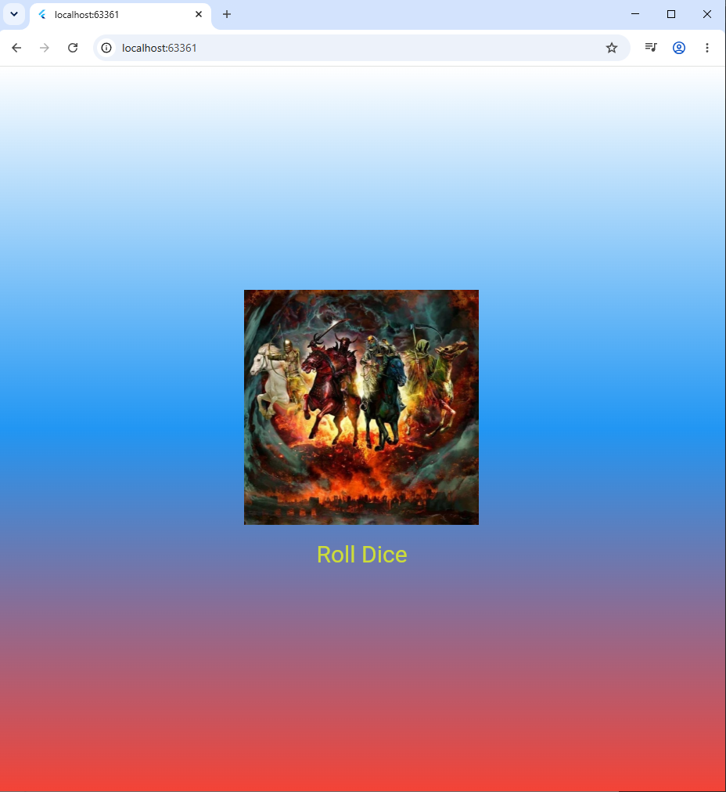

# Лабораторная работа №4-5. Flutter: структура UI и компонентный подход
### Корначев Кирилл, ИСП-243, Дата сдачи: ????
## Что изучили:
* **Инициализация проекта и Git:** Создан новый Flutter-проект, настроен файл `.gitignore` для исключения неиспользуемых платформ и IDE, а также осуществлена привязка локального репозитория к GitHub.
* **Построение дерева виджетов:** Освоена базовая структура UI с использованием каркаса `Scaffold`, контейнеров `Container` и выравнивания `Center`.
* **Кастомизация визуального стиля:** Реализован полноэкранный фон с использованием линейного градиента (`LinearGradient`) через параметр `decoration`, настроено направление градиента и стилизован текст.
* **Компонентный подход и декомпозиция:** Монолитный код из метода `main()` был успешно разбит на логические составляющие. Созданы и вынесены в отдельные файлы кастомные виджеты `GradientContainer` и `StyledText`.
* **Параметризация виджетов:** Виджеты сделаны гибкими и переиспользуемыми за счет передачи данных (текстовых строк и набора цветов) через конструкторы классов.
* **Управление состоянием:** Проведен рефакторинг статического интерфейса в динамическое приложение **Roll Dice App**. 
## Скрин самого приложения

## Ссылка на репозиторий 
[Github](https://github.com/K123456-alt/Flutter_Lab4.git)
## Инструкция по запуску
 - Переходим cd `Flutter_Lab4`
 - Далее переходим `cd lib/gradient_container.dart`
 - Открываем терминал через `Ctrl + j`
 - Прописываем команду: `flutter run -d chrome`
 - Дальше после того как открыло окно в **chrome** можем нажатием на **Roll Dice** менять картинки.
### 1. Зачем выносить виджеты в отдельные файлы? Что изменится если держать всё в main.dart?
Вынос виджетов в отдельные файлы — это стандарт разработки на Flutter. Это необходимо для декомпозиции интерфейса: так код становится чище, в структуре проекта легче ориентироваться, а нужные компоненты проще искать и изменять. Если держать абсолютно всё в файле `main.dart`, то при росте приложения дерево виджетов станет огромным и запутанным, код превратится в монолитную «кашу», которую практически невозможно поддерживать, переиспользовать в других экранах или изменять совместно с другими разработчиками.
### 2. Что такое BuildContext? Почему метод build() принимает его как параметр?
`BuildContext` — это объект, содержащий метаданные о положении конкретного виджета в общем дереве элементов приложения. Flutter автоматически передает его при каждой перерисовке интерфейса. Метод `build(BuildContext context)` принимает его, так как виджету необходимо знать свое окружение: где он находится, кто его родитель, какие медиа-параметры экрана (разрешение, ориентация) актуальны в данный момент, а также для того, чтобы иметь доступ к глобальным темам оформления и навигации.
### 3. Чем StatelessWidget отличается от StatefulWidget? Приведите пример когда нужен каждый из них.
Основное отличие заключается в возможности динамически изменять внутреннее состояние (`State`) и перерисовывать UI.
* **StatelessWidget** — это виджет без состояния. Он отрисовывается один раз по переданным конфигурациям и не может измениться сам по себе в процессе работы приложения. 
  * *Пример:* Текстовая надпись (`StyledText`), отображающая фиксированный заголовок, или иконка.
* **StatefulWidget** — это виджет, который хранит изменяемые данные (состояние) в специальном отдельном объекте класса `State`. При изменении этих данных вызывается метод `setState()`, принудительно перестраивающий UI на экране.
  * *Пример:* Экран броска кубика (`DiceRoller`), где при нажатии кнопки картинка кости меняется на случайную.
### Почему Random() создаётся на уровне файла, а не внутри rollDice()?
Если инициализировать объект `Random()` непосредственно внутри функции `rollDice()`, то при каждом тапе по кнопке будет заново выделяться память и ресурсы процессора под создание генератора случайных чисел с нуля. Создание единого глобального объекта `randomizer` на уровне файла работает значительно эффективнее, так как один и тот же экземпляр генератора используется повторно при каждом броске, оптимизируя производительность приложения.
